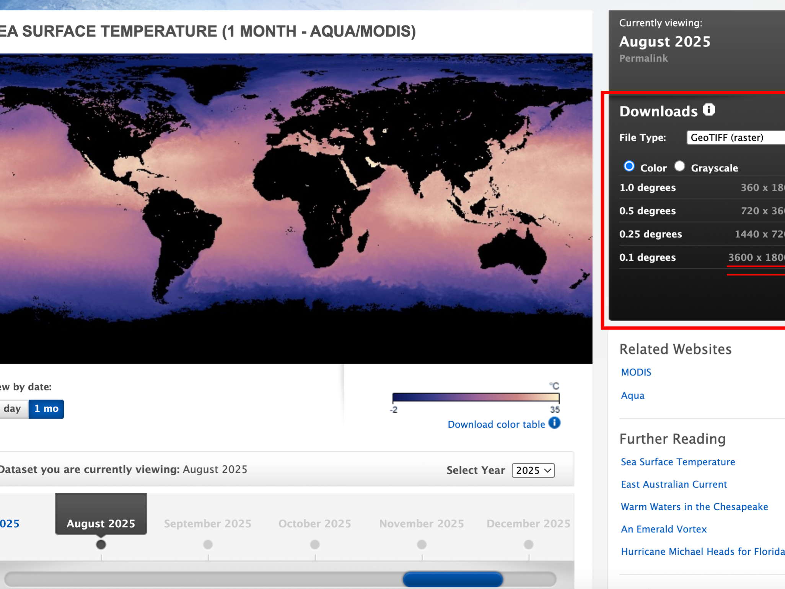

```{r setup, include=FALSE}
knitr::opts_chunk$set(echo = TRUE)
```

# Introduction

Welcome to Seascape Ecology Lab 4. Today we will practice reading in raster data, performing some analyses on those data, making simple maps, and writing out (saving) rasters in different formats.

Remember to refer to the [*Geocomputation with R*](https://r.geocompx.org/index.html) book for more help, as well as [terra's website](https://rspatial.org/terra/pkg/index.html).

Remember that these tutorials are all hosted on github (<https://github.com/ryanreisinger/SOES3056>), where you can also find the data and see the R Markdown file used to make the PDF and HTML output. This will be useful for your assessment.

**Remember to set your working directory with `setwd()` before we start.**

# Bathymetry data

You'll often want to use bathymetry data in your work, be it simple for maps, or for seascape analyses. Bathymetry data are 3D: we have x (longitude) and y (latitude) coordinates, and depth values.

There are a few commonly-used sources for global bathymetry data, including ETOPO (<https://www.ngdc.noaa.gov/mgg/global/global.html>) and GEBCO (<https://www.gebco.net/>). You can manually download these data from the websites, but today we'll try and use the `marmap` package (https://cran.r-project.org/package=marmap) to download data from inside RStudio.

If you can't get `marmap` to work (sometimes it doesn't install, or refuses to download files), the files are on the Seascape Ecology Github site.

First, we need to install `marmap`, and other packages we will use.

```{r eval=FALSE, include=TRUE}
# Install marmap library
# Note, by setting 'dependencies = TRUE', I am asking R to also install all the packages marmap needs
# to work
install.packages("marmap",
                 repos = "https://cran.rstudio.com/",
                 dependencies = TRUE)

# If necessary, install grec
install.packages("grec",
                 repos = "https://cran.rstudio.com/",
                 dependencies = TRUE)

# Install the viridis package for some more colour palettes
install.packages("viridis",
                 repos = "https://cran.rstudio.com/",
                 dependencies = TRUE)
```


Now, we can load the packages.

```{r}
# Load (attach) the library
library(marmap)
```

If that worked, we can now download some bathymetry data.

In their [vignette on importing and exporting data with marmap](https://cran.r-project.org/web/packages/marmap/vignettes/marmap-ImportExport.pdf), the authors say:

> getNOAA.bathy() is the easiest way to load data into R, but it depends on the NOAAdownload protocol, and one must have an internet connection. However, setting the keep argument to TRUE will save on disk the data downloaded from the NOAAservers when the function is called for the first time. Any subsequent call to getNOAA.bathy() with the same list of arguments (i.e. same longitudes, latitudes and resolution) will preferentially load the dataset saved on disk in the current working directory. This allows the users to run scripts without having to query the NOAA servers and download the same data again and again, making the use of getNOAA.bathy() possible even off-line.

NOAA hosts the ETOPO dataset, so this function is going to download it.

Let's reproduce the example in the `marmap` vignette ['Analysing bathymetric data in R with marmap'](https://cran.r-project.org/web/packages/marmap/vignettes/marmap-DataAnalysis.pdf).

```{r}
# We pass two longitude values and two latidue values to the function to define the extent of the area we want. The resolution argument specifies the resolution of the grid in minutes. We are working with an unprojected coordinate system, in longitude and latitude measured in degrees: each degree is divided into 60 minutes.
papoue <- getNOAA.bathy(lon1=140, lon2=155, lat1=-13, lat2=0, resolution=4)

# IF THE FUNCTION DOES NOT WORK:
# If you can't get this function to work (sometimes NOAA's servers get overwhelmed), you can
# 'uncomment' (by removing the preceding # sign) and run the following line after downloading the file
# from Blackboard and saving it in a folder inside your working directly, called 'data'.
# (remember to first create the folder if it does not exist

# papoue <- readRDS("./data/papoue.RDS")

# You could also download the file from Github at:
# https://github.com/ryanreisinger/SOES3056/blob/main/Lab%2004/data/papoue.RDS

# This object is a special kind of raster in marmap's own format. We can see that by asking R about the class:
class(papoue)

# marmap has its own plotting method, so we can simply type:
plot(papoue)
```

```{r}
# Or we can make the plot a bit nicer, using the examples from marmap

#Creating color palettes 
blues <- c("lightsteelblue4","lightsteelblue3", "lightsteelblue2", "lightsteelblue1")
greys <- c(grey(0.6), grey(0.93), grey(0.99))

plot(papoue, image = TRUE, land = TRUE,
     deepest.isobath = min(papoue),
     shallowest.isobath = max(papoue),
     step = 500, # Set the interval between contour lines
     lwd = 0.03,
     bpal = list(c(0, max(papoue), greys), c(min(papoue), 0, blues)))
```

You can work through the marmap vignettes to learn more about making nice bathymetry plots, and doing some simple analyses.

For the moment, we're going to continues our analyes. However, we want to work with a raster in the `terra` package, so let's first convert the class of this object.

```{r}
# First, we'll use one of marmap's functions to convert this object into a raster.
papoue_raster <- marmap::as.raster(papoue)

# See, the class has changed
class(papoue)
class(papoue_raster)

# We could use the raster package to analyse this raster now, but remember last week I said that the terra package is the new, future-proof version of raster, so let's convert to a terra raster.

# First, load terra
library(terra)

# Then, convert
papoue_terra <- terra::rast(papoue_raster)

# Notice the class has changed
class(papoue_terra)

# Now we can plot it with terra
# The argument 'main' allows me to give the plot a title
plot(papoue_terra,
     axes = TRUE,
     main = "Papoue")

# Let's choose better colours
plot(papoue_terra,
     axes = TRUE,
     main = "Papoue",
     col = topo.colors(125))

# The colour palette is not that smart, it doesn't understand that negative values should be blue. We'll solve that kind of problem later, or you can use marmap to make maps easily
```

Let's take a look at some of the characteristics of the data we downloaded. Remember in seascape analyses we're interested in the *extent* and *grain* of the data.

We can get all sorts of information simply by 'printing' the object (typing the name into the R console or running the name from RStudio, or we can use functions to get only the information we want.

```{r}
# Print the object to get some information about it
papoue_terra

# Notice the extent and the resolution. Remember that the raster is not projected, so the measurements are all in degrees. So, this raster has a resolution of 0.06 by 0.06 degrees. Remember, we asked for a resolution of 4 minutes (4/60 = 0.06666)

# We can also get the values using functions.

# Resolution
res(papoue_terra)

# Extent
ext(papoue_terra)

# Minimum and maximum value (this is in meters - the values, or z dimension, of the raster can be in any unit, unlike the x and y measurements that are defined by the coorindate system.

minmax(papoue_terra)

# We could also look at the distribution of values in a histogram
# notice that I type 'terra::hist()' - this tells R I want to specifically use the 'hist()' function from the 'terra' package. Sometimes different packages have the same name, and R doesn't always understand which one to use.
terra::hist(papoue_terra)

```

## Conceptual models for seascape analyses

We've talked a lot previously about the two models for seascape analyses:

1.  The patch-mosaic model
2.  The spatial gradient model

### Patch-mosaic

Recall, for the patch-mosaic model we often convert continuous input into **categorical** input by **classification**.

Let's classify our bathymetry raster. For a simple classification exercise, we can decide *a-priori* what we want our categories to be. Although this is simply an example in this lab, you might well do this in practice if you have some basis for the classification.

To use the classification function in `terra`, we first have to define the values.

```{r}
# The classify function in terra has an argument 'rcl', where we can pass a matrix that defines how we want to classify the matrix. It can have three columns, the first two columns define ranges in the input raster, and the third column defines what cells which fall in that range 'become'.

# So, let's make a simple one to classify the raster as land and sea. Land values will be positve, and sea values negative.

# We can adapt the example given in the the 'classify' functions help page:
?classify # scroll down to the examples

## from-to-becomes
# classify the values into land and sea.
# we can't mix numeric and character values here, so we use 1 to indicate sea and 2 to indicate land.
# all values >= -15,000 and <= -1 become 1, etc.
m <- c(-15000, -1, 1,
       0, +15000, 2)
reclass_matrix <- matrix(m, ncol=3, byrow=TRUE)

# We used huge values for the minum (-15,000) and maximum (+15,000), but remember that we can look up those values with the minmax() function.

# Have a look at what the matrix looks like
reclass_matrix

# Now we can classify our raster
papoue_classified <- classify(papoue_terra,
                              reclass_matrix,
                              include.lowest=TRUE,
                              others = NA) # the argument 'others = NA' means that values which don't fall into one of the categories in our classifaction matrix, get no value (NA).

# And let's see what happens when we plot it
plot(papoue_classified)

# Let's try a slightly more complicated example, where we classify a few bathymetric categories.

# First, we redefine the matrix, then we classify and plot
m <- c(-15000, -200, 1,
       -200, 0, 2,
       0, 15000, 3)
reclass_matrix <- matrix(m, ncol=3, byrow=TRUE)
papoue_classified <- classify(papoue_terra,
                              reclass_matrix,
                              include.lowest=TRUE,
                              others = NA)
plot(papoue_classified)

# I chose 200 m (-200) to approximately represent the continental shelf edge.

# We can turn the raster into a truly categorical raster with factor levels (which work similarly to other factors in R)

cls <- data.frame(id=1:3, cover=c("deep-sea", "shelf", "land"))
levels(papoue_classified) <- cls

# When we plot now, the category names are shown
plot(papoue_classified)
```

### Spatial gradient

We can also analyse the bathymetry data using the spatial gradient conceptual model. To do this, we use the continuous-value raster - `papoue_terra`.

Recall from Chapter 2 of the seascape ecology textbook (and Lecture 04), that we are often interested in *morphometrics* of the seafloor.

We can easily calculate some simple morphometrics using the `terrain` function in `terra`.

```{r}
# The specific metric we want is set by passing different values to the 'v' argument in the function.

# Slope
plot(terrain(papoue_terra, v = "slope"))

# notice that I am wrapping the function in a plot call to immediately visualise the result. It is not being saved to a named variable in our environment.

# Terrain Roughness Index (TRI)
plot(terrain(papoue_terra, v = "TRI")) # the output is very similar to slope
```

The paper by Phil Bouchet et al., which I mentioned in Lecture 04, has a detailed discussion of different morphometrics and their importance to marine predators: <https://doi.org/10.1111/brv.12130>.

### Saving rasters

At some stage we might like to save the rasters we've worked on. We can do that using `writeRaster` (from <https://rspatial.org/terra/spatial/5-files.html#writing-raster-data>).

> Use \`writeRaster\` to write raster data. You must provide a SpatRaster and a filename. The file format will be guessed from the filename extension. If that does not work you can provide an argument like \`format=GTiff\`. Note the argument \`overwrite=TRUE\` and see \`?writeRaster\` for more arguments, such as \`datatype=\` to set the a specific datatype (e.g., integer).

Notice that I am writing the file to a folder called 'output', so I can keep my working folder neat and tidy.

```{r}
x <- writeRaster(papoue_terra, "output/test_output.tif", overwrite = TRUE)
x
```

And we can read raster files into R thus.

```{r}
rm(x) # remove x from the environment.
x <- rast("output/test_output.tif") # and try reading our file in.
```

## Sea surface temperature

Let's take a look at a dynamic variable -- sea surface temperature (SST).

There are many sources for sea surface temperature. In a future Lab we will look at finding environmental data for your analyses. There are also some R packages that can make the job of downloading and managing those data easier. For example, have a look at [this tutorial](https://cran.r-project.org/web/packages/heatwaveR/vignettes/OISST_preparation.html) and [this one](https://coastwatch.gitbook.io/satellite-course/tutorials/r-tutorial/1.-how-to-work-with-satellite-data-in-r) -- both use the `rerddap` package (<https://docs.ropensci.org/rerddap/>). Also look at `bowerbird` (<https://docs.ropensci.org/bowerbird/articles/bowerbird.html>), a package designed to create and maintain your own local (i.e., on your own computer) copies of environmental datasets. Today, we'll keep it simple.

I went to the NASA Earth Observations website for sea surface temperature data from Aqua/MODIS: <https://neo.gsfc.nasa.gov/view.php?datasetId=MYD28M>.

MODIS (Moderate Resolution Imaging Spectroradiometer) is a sensor on board NASA's Aqua satellite: <https://modis.gsfc.nasa.gov/>

I chose monthly ('1 mo') data for August 2025, downloaded this as 'GeoTIFF (raster)', at 0.1 degrees resolution.

Clicking on the '3600 x 1800' text link (double red underline in the screenshot below) will download the data. You'll need to register (quick and free) to download the data.




I saved the file, called `MYD28M_2025-08-01_rgb_3600x1800.TIFF` in a folder called `data` in my working folder. Remember, we don't want to touch our raw data and we want to keep it separate from things we are working on and manipulating (e.g, the derived raster called `papoue_terra` that I wrote to a file called `test_output.tiff` in the `output` folder -- that is a derived output).

This file is on the module's Github page: https://github.com/ryanreisinger/SOES3056/tree/main/Lab%2004/data 

```{r}
# Read in the GeoTiff file
sst <- rast("./data/MYD28M_2025-08-01_rgb_3600x1800.TIFF")

# Look at some properties
sst

# And plot
plot(sst)
```

Let's remove the rasters from our workspace before we carry on. They can take up a lot of memory. We take two steps. First, we remove the objects with `rm()`, then we also remove any temporary rasters that we can't see, with `tmpFiles()`.

```{r}
# Remove the raster objects
rm(sst)

# Remove any temporary raster files.
tmpFiles(remove = TRUE)
```

We'll discuss getting data (including working with a format called NetCDF) in more detail in a later lab, for the moment, let's read in some SST files that I have downloaded. 

**You should download them from Github: https://github.com/ryanreisinger/SOES3056/tree/main/Lab%2004/data/sst_files**

There are seven files (all with a .tif extension. Save these inside a folder called `sst_files` in your `data` directory.

Once you've done that, verify the files are in the right place using the `list.files()` function. This is a handy function for when you start programmatically accessing lots of files.

```{r}
# Check that you downloaded the files in the right place.
list.files("./data/sst_files")
```

There are seven SST files. Each file is the daily sea surface temperature for an area in the North Sea, north-east of the Scottish mainland (I want to reproduce the same area as Figure 3.3 in the Scales et al. chapter).

Let's look at one of these:

```{r}
sst_01 <- rast("./data/sst_files/sst_2020-01-01.tif")

# Check out the resolution, extent and coordinate reference system.
sst_01
```

Note: The coordinate reference system we get by calling `crs(sst_01)` is

    lon/lat WGS 84 (EPSG:4326) 

This is the WGS 84 system, a common one used, for example, for GPS. We can look up the coordinate reference system using the EPSG code (4326) on the epsg.io website: <https://epsg.io/4326>.

Let's plot our raster

```{r}
plot(sst_01)
```

Notice the values. The temperature is measured in Kelvin, so we need to correct it.

We can use *raster algebra* in various ways. In this case, we can substract a single value from the whole raster to make the correction.

```{r}
sst_01 <- sst_01 - 273.15 # We simply subtract the correction value
plot(sst_01)
minmax(sst_01)
```

Let's read in the files for all seven days, and correct them as we read them in.

```{r}
sst_01 <- rast("./data/sst_files/sst_2020-01-01.tif") - 273.15
sst_02 <- rast("./data/sst_files/sst_2020-01-02.tif") - 273.15
sst_03 <- rast("./data/sst_files/sst_2020-01-03.tif") - 273.15
sst_04 <- rast("./data/sst_files/sst_2020-01-04.tif") - 273.15
sst_05 <- rast("./data/sst_files/sst_2020-01-05.tif") - 273.15
sst_06 <- rast("./data/sst_files/sst_2020-01-06.tif") - 273.15
sst_07 <- rast("./data/sst_files/sst_2020-01-07.tif") - 273.15
```

### Raster stacks

We can have many layers in a raster, representing different times or different bands in the case of multispectral imagery. This means we can 'stack' each daily file into a single 'raster stack' with 7 layers.

```{r}
# We simply use the c() function
sst_all <- c(sst_01, sst_02, sst_03, sst_04, sst_05, sst_06, sst_07)
plot(sst_all)
```

Again, we can use mathematical functions to work with rasters. For example, we could calculate the average value in each grid cell (pixel) across the whole week. Notice that this will produce a single raster, because we have calculated a single mean for each cell.

```{r}
sst_mean <- mean(sst_all)
plot(sst_mean,
     main = "Mean of sea surface temperature")
```

Or we could have looked at the variance to see how variable SST was in each grid cell across the week. In this case we use the `app` function, which applies a function to a raster stack.

```{r}
# we tell the app function we want to use the variance function - var() - with fun = "var"
sst_variance <- terra::app(sst_all, fun = "var")
plot(sst_variance,
     main = "Variance in sea surface temperature")
```

Look at the `terra` tutorial for more examples: <https://rspatial.org/terra/rs/3-basicmath.html>.

### Finding spatial gradients

Let's find a spatial gradient in one of the sst rasters. We can use the `terrain()` function that we used earlier, since this is also a kind of gradient (although the output units in this case don't quite make sense).

```{r}
sst_gradient <- terrain(sst_01, v = "slope")
plot(sst_gradient,
     main = "Sea surface temperature gradient")
```

That's starting to look a bit like Figure 3.3 in the Seascape Ecology textbook, right? The green areas are regions with high SST gradient - they are places were SST is changing quickly across space. Ecotones?

We can also apply this kind of function to the whole stack using the `sapp()` function and in this case the function works layer by layer instead of calculating a value in each cell *across* all the layers.

```{r}
# Warning: this will take a while to run
sst_all_gradient <- sapp(sst_all, terrain, v = "slope")
plot(sst_all_gradient)
```

But let's calculate sea surface temperature fronts (also a kind of gradient) using a proper algorithm - Belkin & O'Reilly's (2009) front detection algorithm (<https://doi.org/10.1016/j.jmarsys.2008.11.018>).

For that we'll need the `grec` package.

```{r message=FALSE, warning=FALSE}
# Load the grec library we installed earlier
library(grec)

# And run the function
sst_fronts <- getGradients(as.matrix(sst_01, wide = T))

# But we have to convert back to raster
sst_fronts <- rast(sst_fronts) # convert back to a terra raster
# Copy spatial reference and extent from sst_01
terra::ext(sst_fronts) <- terra::ext(sst_01)
terra::crs(sst_fronts) <- terra::crs(sst_01)

# And plot
plot(sst_fronts)
```

So, it looks about the same as the raster we calculated with the `terrain` function, but notice that the units are different. They are now in degrees Celsius per km.

Let's make the map a bit better.

```{r}
# Load the viridis library for more colour palettes
library(viridis)

# And plot
terra::plot(sst_fronts,
     main = "Sea surface temperature fronts", # main title
     legend = "bottom", # put the legend at the bottom
     plg = list(title = "SST gradient (°C/km)"), # a title for the legend
     col = viridis(125)) # use the viridis colour scale

# Add a scale bar
terra::sbar()

```

# More reading and practice

For more, continue working on the tutorials from

-   Geocomputation with R\
    <https://geocompr.robinlovelace.net/>

-   Spatial Data Science with R and "terra"\
    <https://rspatial.org/terra/index.html>
