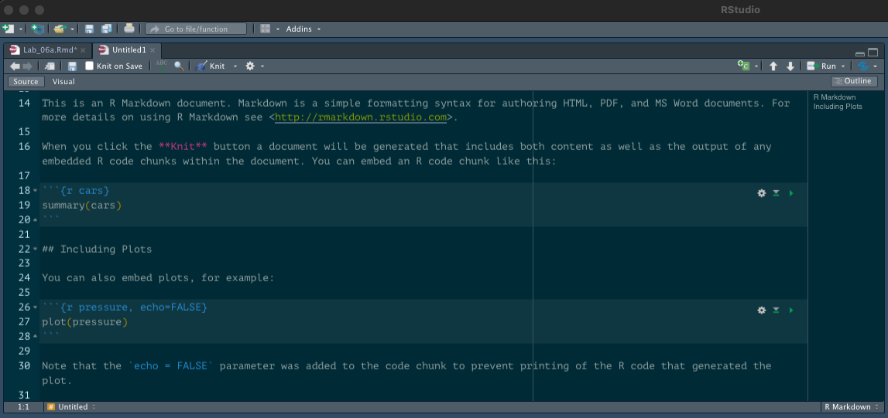

```{r setup, include=FALSE}
knitr::opts_chunk$set(echo = TRUE)
```

# Introduction

Throughout the Seascape Ecology course, we have been learning to use R to conduct our seascape analyses. You'll recall from our first lab that I said programming has some important advantages:

1.  It saves time (eventually).

2.  It is more transparent.

3.  It is reproducible.

4.  Programming forces you to think clearly about a problem.

To support points 2 and 3, we have been writing and saving our code in text files called 'scripts'. Specifically we have created R scripts containing code in the R language, and signified by a `.R` file extension.

When we want to generate a report, like a project writeup or a paper, we usually write the text in a word processor such as Microsoft Word; perhaps copy and paste some results from R, insert figures and tables that we saved as R output (or copied from RStudio) and -- if we are really organised -- we provide our scripts and files that we need for the analyses.

**Wouldn't it be useful if we could wrap that all up in one one process?**

We can, using **R Markdown.**

You will be using R Markdown for your workflow assessments.

# What is R Markdown?

R Markdown (<https://rmarkdown.rstudio.com/>) is a document format that allows us to embed pieces (called "chunks") of computer code and output like figures in a document. The document you are reading now is made with R Markdown, as are all the other tutorials you have been using in this module.

Xie et al. write:

> R Markdown provides an authoring framework for data science. You can use a single R Markdown file to both
>
> -   save and execute code, and
>
> -   generate high quality reports that can be shared with an audience.

<https://bookdown.org/yihui/rmarkdown/basics.html>

R Studio has a short introductory video at <https://rmarkdown.rstudio.com/lesson-1.html>.

R Markdown consists of a file, with extension .Rmd, that contains text in the Markdown format -- a simple way of formatting the text with things like headings, bold, links, etc. -- and code. A report is created automatically by running the code (and printing the code and/or results in the output document if you wish) and 'rendering' the text. Reports can be in various formats like HTML (this document) or PDF (see previous labs).

The best guide to R Markdown is the free and open-source R Markdown book by Xie et al.: [https://bookdown.org/yihui/rmarkdown/](https://bookdown.org/yihui/rmarkdown/basics.html)

We will be using R Studio to create our R Markdown reports.

# Getting started

We'll assume you have both R and R Studio installed. To use R Markdown we'll need a few packages.

```{r eval=FALSE}
# If we want to produce PDF files, we'll need some kind of TeX (pronounced
# 'tech') installation.
# TeX is a typesetting programme.
# Installing TeX might not work on the University computers. If not, 
# it's okay -- we can still produce HTML files.

# We will use tinytex https://yihui.org/tinytex/

# First install tinytex
# This might not work on the uni. computers.
install.packages('tinytex')
library(tinytex)
tinytex::install_tinytex()

# If you have difficulty, follow instruction at the link below,
# or just stick to HTML output
# https://yihui.org/tinytex/

# Next, install rmarkdown
install.packages("rmarkdown")
library(rmarkdown)

```

# Basics

You can have a look at at the basics in the R Markdown book (<https://bookdown.org/yihui/rmarkdown/basics.html>) or work through the R Studio lessons (<https://rmarkdown.rstudio.com/lesson-1.html>).

We're going to use R Studio to create an R Markdown.

## Create a folder for your working directory

The first step is to create an empty directory that you will use as your working directory, where you will save the Markdown file and keep all your data and outputs. It is important to keep everything in one folder. For your assessment you will hand in this single folder containing everything needed to recreate the report and analysis. This is good practice for the 'real world' -- you can use this approach to give someone else evertything they need to do an analysis, or if running your analyses on a different computer.

I'll create a new, empty folder called `seascape_project`.

## Create a new R Markdown document

After having installed `rmarkdown`, close and re-open R Studio. Click on 'File' then 'New file' then 'R Markdown'. This should bring up a window (Figure 1) where you can choose the document type at left (we want a Document) and specify some parameters: title (title of your document - will appear as the the title of the report), author (your name), date (you can enter a date, or opt to use the current date by selecting 'Use current date when rendering document'), and the default output format. If you have had any problems installing a TeX programme (e.g., TinyTeX), then select HTML. You can still choose to 'render' different formats, this is simply the default. Click 'OK'.

[](Figure%201)

## Save the document

This will open up a new tab in R Studio with an R Markdown document that looks something like that in Figure 2.

[](Figure%202)

Now, save this file in the directory you just created. Click 'File' then 'Save' or 'Save as' (or use the small blue stiffy disk icon). We use the same structure as for saving scripts: keep everything you need together in a single folder, ideally with subfolders.

## Knit an HTML document

Before we change anything in this file, let's try 'rendering' or 'knitting' it. Find the blue ball of wool/yarn icon with 'Knit' next to it, highlighted in Figure 3, and click on that. This should open a dialogue asking you where you want to save the output file. I recommend your working directory, or even a sub directory for outputs.

[](Figure%203)

This should produce an HTML document in a new window, which looks something like Figure 4.

[](Figure%204)

When you click 'knit', R will run all the code in the R Markdown file.

If you look near the top left of the tab, you'll see you can toggle between 'Source' and 'Visual' mode. The 'Visual' mode lets you edit the Markdown more like you would in a regular word processor, while the 'Source' mode lets you edit the Markdown code directly.

## Code chunks

You'll see that, interspersed through the text, there are sections of code (called 'chunks') that are are delineated with three backtick symbols and `r` in curly braces:

```` ``` {r} ````

`print("hello")`

```` ``` ````

The code will appear in the report, and R will run whatever is inside these chunks, and the result of the code will be printed in the report.

For example:

```{r}
print("hello")
```

You can tell R NOT to print the code in the report using `echo = FALSE`. For example, if I don't want to show the code chunk I write:

```` ```{r, echo = FALSE} ````

`print(hello)`

```` ``` ````

This chunk will not appear in the report (you can see that it's not in a block like the other pieces of code in this report).

In the R Markdown file (`.Rmd`), in RStudio, you can run each chunk by clicking the green 'play' icon at the top right of the chunk.

# Your turn

These are just some simple instructions to get you up and running. For homework, work through the lessons on R Studio's Markdown site: <https://rmarkdown.rstudio.com/lesson-1.html>. 

Their reference guide (<https://rmarkdown.rstudio.com/docs/reference/index.html>) and cheatsheet (<https://github.com/rstudio/cheatsheets/raw/main/rmarkdown-2.0.pdf>) are also good.

For more complete information, look at the R Markdown book by Xie et al.: <https://bookdown.org/yihui/rmarkdown/>.

For homework, or in the lab session if you have time, try to convert the first parts of some of your scripts from previous weeks into R Markdown scripts, and try to produce HTML reports. Create a new R Markdown document as described above (or use the one we made above), and copy your R scripts into code 'chunks'. It's up to you to decide how to split up these chunks. Usually a chunk will be some kind of block of code, doing a specific step, with some kind of text in-between.

Remember, for your final assessment you should hand in a single folder which contains all the data and scripts (ideally, R Markdown `.Rmd` + report output) for a seascape analysis.

For example, my folder structure to create this lab looks like this:

[](Figure%205)

For more examples, you can also look at how I made any of the labs for this module. They are all available on the module's Github page:
<https://github.com/ryanreisinger/SOES3056>