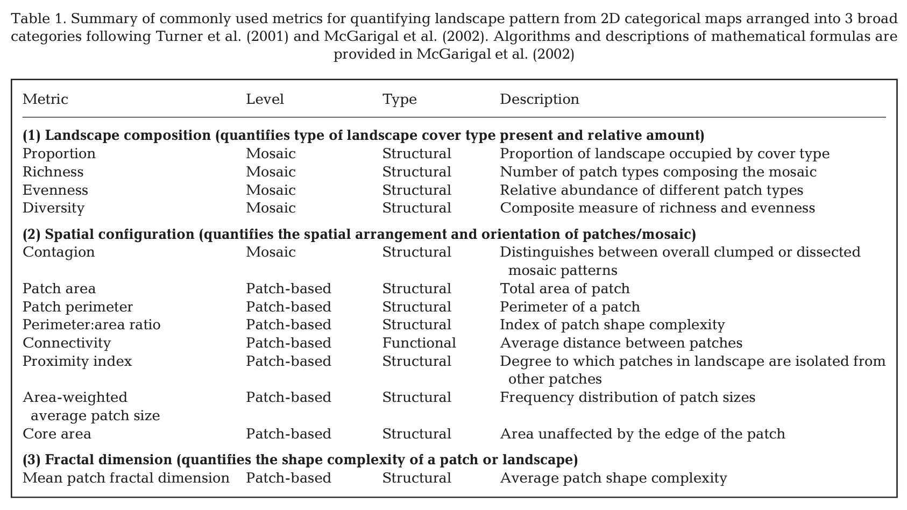

```{r setup, include=FALSE}
knitr::opts_chunk$set(echo = TRUE)
```

## Introduction

Today we will look at a short example of using the `landscapemetrics` R package to calculate patch metrics from raster data. Remember, patch metrics are measures of the size, shape, and configuration of patches of habitat. This applies to the patch-mosaic and patch matrix models.

The package's website has some general background: <https://r-spatialecology.github.io/landscapemetrics/articles/general_background.html>

The paper describing the package can be found here: <https://doi.org/10.1111/ecog.04617>

```{r}
# Load packages
library(terra)
library(landscapemetrics)
library(dplyr)
```

First, we'll get some data. `landscapemetrics` has a few built-in datasets. Let's use `podlasie_ccilc`, which is a land cover map of the Podlasie region of Poland. This is a 300 m resolution raster dataset with 5 land cover classes.

```{r}
# Get landscape data
# The terra::unwrap() functions processes this kind of raster dataset
my_dat <- terra::unwrap(podlasie_ccilc)
plot(my_dat)
```

It's recommended to first use the `check_landscape()` function to make sure your raster is in the right format.

The requirements to calculate meaningful landscape metrics are:

-   The distance units of your projection are meters, as the package converts units internally and returns results in either meters, square meters or hectares. For more information see the help file of each function.

-   Your raster encodes landscape classes as integers (1, 2, 3, 4, ..., n).

-   Landscape metrics describe categorical landscapes, that means that your landscape needs to be classified (we throw a warning if you have more than 30 classes to make sure you work with a classified landscape).

```{r}
check_landscape(my_dat)
```

Our raster is categorical (it has integer values), but it's not in a project coordinate system: the CRS is 'geographic' and the units are 'degrees' (it would be 'meters' if it was projected). Let's fix that. [Choosing a coordinate reference system is quite specific](https://learn.arcgis.com/en/projects/choose-the-right-projection/), but let's choose a global, general projection for this excercise. We'll use the Robinson projection, which is a global projection that preserves area and shape. It's not perfect, but it's a good compromise for global data. I found the 'proj4' string for this projection on the <https://epsg.io/53030> website. Note, we must set the `method` argument to equal `near` -- nearest neighbour interpolation -- otherwise when the reprojection occurs, the raster values will be changed from integer values to numeric values.

```{r}
my_dat <- project(x = my_dat,
                  y = "+proj=robin +lon_0=0 +x_0=0 +y_0=0 +R=6371000 +units=m +no_defs +type=crs",
                  method = "near")
```

Now check our landscape again:

```{r}
check_landscape(my_dat)
plot(my_dat)
```

We can also look at the patches using the `show_patches` function.

```{r}
show_patches(my_dat)

```


Notice that the axis values have changed (the map now has meter units) and the raster is a bit 'skew' because of the reprojection into a projected coordinate reference system.

Now, we can calculate some metrics. Remember from Lecture 4, Table 2.1 and Table 2.2 in Pittman chapter 2 show metrics that we can calculate, or we can look in the paper [Wedding et al. 2011](https://doi.org/10.3354/meps09119).



We can calculate patch-, class- and lanscape-level metrics. All functions start with `lsm_` and then `c`, `p`, or `l` for 'class', 'patch' or 'landscape level, followed by the specific function: 

For example, 

```{r}
# Patch-level
# This function calculates the area of each patch
patch_area <- lsm_p_area(my_dat)
patch_area

# We do a bit more work to summarise the information returned
# We use dplyr to group the data table by class, then summarise the
# data, calculating the means, standard deviations, min and max values
# for each class
patch_area <- dplyr::group_by(patch_area, class)
patch_area <- dplyr::summarise(patch_area,
            mean_area = mean(value),
            sd_area = sd(value),
            min_area = min(value),
            max_area = max(value))
patch_area
```