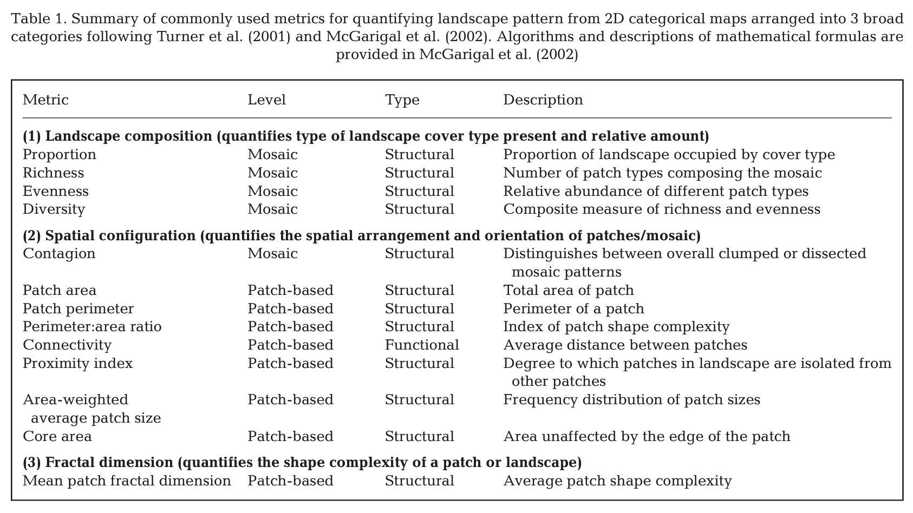

```{r setup, include=FALSE}
knitr::opts_chunk$set(echo = TRUE)
```

## Introduction

Today we will look at a short example of using the `landscapemetrics` R package to calculate patch metrics from raster data. Remember, patch metrics are measures of the size, shape, and configuration of patches of habitat. This applies to the patch-mosaic and patch matrix models.

The package implements metrics from a computer programme called FRAGSTATS (<https://www.fragstats.org/>), which is widely used in landscape ecology. The package can calculate a wide variety of landscape metrics at the patch, class, and landscape levels.

The package's website has some general background: <https://r-spatialecology.github.io/landscapemetrics/articles/general_background.html>

The paper describing the package can be found here: <https://doi.org/10.1111/ecog.04617>

```{r}
# Load packages
library(terra)
library(landscapemetrics)
library(dplyr)
```

First, we'll get some data. `landscapemetrics` has a few built-in datasets. Let's use `podlasie_ccilc`, which is a land cover map of the Podlasie region of Poland. This is a 300 m resolution raster dataset with 5 land cover classes.

```{r}
# Get landscape data
# The terra::unwrap() functions processes this kind of raster dataset
my_dat <- terra::unwrap(podlasie_ccilc)
plot(my_dat)
```

It's recommended to first use the `check_landscape()` function to make sure your raster is in the right format.

The requirements to calculate meaningful landscape metrics are:

-   The distance units of your projection are meters, as the package converts units internally and returns results in either meters, square meters or hectares. For more information see the help file of each function.

-   Your raster encodes landscape classes as integers (1, 2, 3, 4, ..., n).

-   Landscape metrics describe categorical landscapes, that means that your landscape needs to be classified (the package throws a warning if you have more than 30 classes to make sure you work with a classified landscape).

```{r}
check_landscape(my_dat)
```

✔ Our raster is categorical (it has integer values)

✖ It's not in a projected coordinate system: the CRS is 'geographic' and the units are 'degrees' (it would be 'meters' if it was projected). Remember back to Lab 3. Let's fix that. [Choosing a coordinate reference system is quite specific](https://learn.arcgis.com/en/projects/choose-the-right-projection/), but let's choose a global, general projection for this excercise. We'll use the Robinson projection, which is a global projection that preserves area and shape. It's not perfect, but it's a good compromise for global data. I found the 'proj4' string for this projection on the <https://epsg.io/53030> website. Note, we must set the `method` argument to equal `near` -- nearest neighbour interpolation -- otherwise when the reprojection occurs, the raster values will be changed from integer values to numeric values (remember from the line above, our raster must have integers, or whole numbers, representing the different classes).

```{r}
# Use the project function to reproject the data
my_dat <- project(x = my_dat,
                  y = "+proj=robin +lon_0=0 +x_0=0 +y_0=0 +R=6371000 +units=m +no_defs +type=crs",
                  method = "near")

# You could also use the ESRI code from the site https://spatialreference.org/ref/esri/53030/ like this:
# my_dat <- project(x = my_dat,
#                   y = "ESRI:53030",
#                   method = "near")
```

Now check our landscape again:

```{r}
check_landscape(my_dat)
plot(my_dat)
```

Notice that the axis values have changed (the map now has meter units) and the raster is a bit 'skew' because of the reprojection into a projected coordinate reference system.

We can also look at the patches using the `show_patches` function.

```{r}
show_patches(my_dat)

```

Now, we can calculate some metrics. From Lecture 4, recall that Table 2.1 and Table 2.2 in Pittman chapter 2 show metrics that we can calculate, or we can look in the paper [Wedding et al. 2011](https://doi.org/10.3354/meps09119).



We can calculate patch-, class- and landscape-level metrics. All functions start with `lsm_` prefix and then `c`, `p`, or `l` for 'class', 'patch' or 'landscape level, followed by the specific function:

For example, patch-level area:

```{r}
# Patch-level
# This function calculates the area of each patch
patch_area <- lsm_p_area(my_dat)
patch_area

# Let's do a bit more work to summarise the information returned
# We use dplyr to group the data table by class, then summarise the
# data, calculating the means, standard deviations, min and max values
# for each class
patch_area <- dplyr::group_by(patch_area, class)
patch_area <- dplyr::summarise(patch_area,
            mean_area = mean(value),
            sd_area = sd(value),
            min_area = min(value),
            max_area = max(value))
patch_area

# You can use the class level function to more quickly return the mean area, or the standard deviation,
mean_class_area <- lsm_c_area_mn(my_dat)
mean_class_area

sd_class_area <- lsm_c_area_sd(my_dat)
sd_class_area
```

Here's an example of calculate something called fractal dimension at the patch level:

```{r}
patch_fractal <- lsm_p_frac(my_dat)
patch_fractal
```

Class-level metrics can be calculated similarly. For example:

```{r}
# Total area of each class
total_class_area <- lsm_c_ca(my_dat)
total_class_area

# Percent of landscape of each class
percent_class_area <- lsm_c_pland(my_dat)
percent_class_area
```

Landscape-level metrics are calculated without grouping by class or patch. For example, landscape-level 'contagion' (<https://www.fragstats.org/index.php/fragstats-metrics/patch-based-metrics/aggregation-metrics/l1-contagion-index>):

```{r}
# Landscape-level
landscape_contagion <- lsm_l_contag(my_dat)
landscape_contagion

# Note that landscape-level metrics return a single value

```

You can calculate many different metrics. See the package documentation for a full list: <https://r-spatialecology.github.io/landscapemetrics/reference/index.html>

More information on each of the metrics is on the FRAGSTATS page at <https://www.fragstats.org/index.php/documentation> (navigate to the metrics using the navigation on the left hand side of the web page)

Let's try an example of looking at some metrics for a seascape.

We can use data from something called the EUSeaMap 2025 Broad-Scale Predictive Habitat Map for Europe. More information is given here:\
<https://emodnet.ec.europa.eu/geonetwork/srv/eng/catalog.search#/metadata/cec07b5e-3a9c-4492-b115-126a17c08697>

You can use their viewer to explore and download the data (<https://emodnet.ec.europa.eu/geoviewer/#>).

However, I did the following

-   I went to the data catalogue: <https://emodnet.ec.europa.eu/geonetwork/srv/eng/catalog.search>

-   I then searched for "EUSeaMap 2025 Broad-Scale Predictive Habitat Map for Europe"

-   Under filters, I selected 'Type of Resource' = 'Dataset', which returned 5 datasets

-   I chose the first dataset and clicked on download icon, which let me download a zip file of the data

-   The direct link is: files.emodnet-seabedhabitats.eu/data/EUSeaMap_2025.zip

-   I unzipped the file, and from there found the raster called "habitat_eunis2007_confidence_overall_2025.tif"

-   I saved that file in my working directory, in a subfolder called 'data'.

-   Let's go from there...

```{r}
# Load the seascape data
seascape <- terra::rast("data/habitat_eunis2007_confidence_overall_2025.tif")

# This is a really gigantic raster, so let's crop it to a smaller area
# Define an extent (xmin, xmax, ymin, ymax) in decimal degrees
seascape_crop <- ext(-10, +0, +50, +60)

# Crop the raster
seascape <- crop(seascape, seascape_crop)

# Plot to check
plot(seascape)

# Check the landscape
check_landscape(seascape)

# Our raster is categorical (it has integers for the classes), but it is not projected (the units are degrees). Let's reproject it to the Robinson projection (https://spatialreference.org/ref/esri/53030/) like we did before.
seascape <- project(x = seascape,
                   y = "ESRI:53030",
                   method = "near")

# Check again
check_landscape(seascape)

# Now we can calculate some metrics
# Let's look at class-level metrics of total area and percent of landscape
total_class_area_seascape <- lsm_c_ca(seascape)
total_class_area_seascape

percent_class_area_seascape <- lsm_c_pland(seascape)
percent_class_area_seascape

# Try calculating some metrics for yourself...
```
